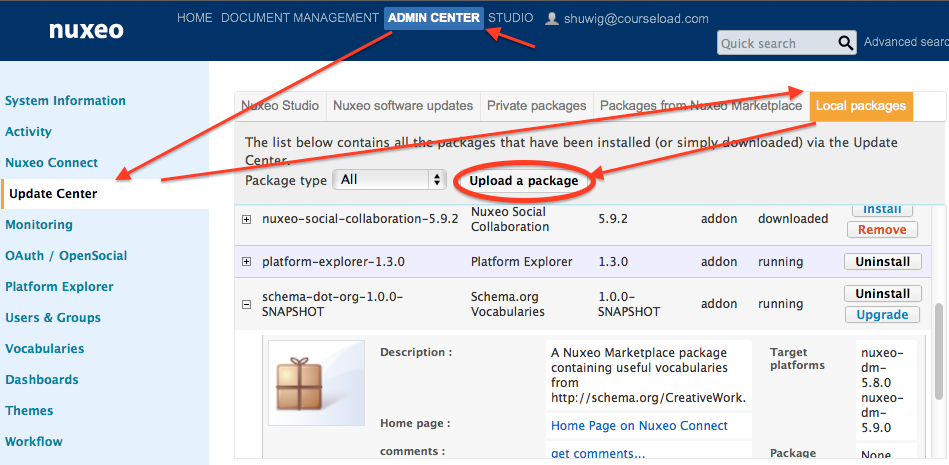
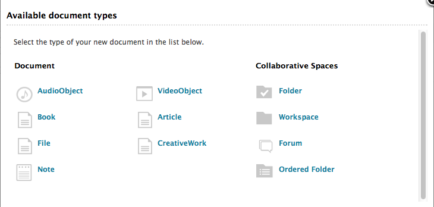
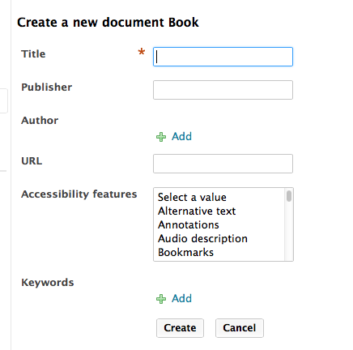

Schema.org Vocabulary for Nuxeo
===============================

What is this?
-------------
The
[Schema.org Vocabulary for Nuxeo](https://github.com/courseload/nuxeo-schema-dot-org)
is a
[Nuxeo Marketplace package](http://doc.nuxeo.com/display/public/NXDOC/Creating+Marketplace+Packages)
that provides additional document metadata schemas and document types
for use in your Nuxeo repository.  It uses the extensive set of
vocabulary terms from [Schema.org](https://schema.org) to avoid
constructing an additional
[ontology](http://en.wikipedia.org/wiki/Ontology_%28information_science%29)
for describing the items covered by Schema.org's classification
system.

Why did we make this?
----------------------

The course materials library at
[Courseload](http://www.courseload.com) is being built with the
[Nuxeo Platform](http://www.nuxeo.com/en/products/content-management-platform)
for content management.  Nuxeo provides a flexible and extensible
development base with sophisticated document and document metadata
handling capabilities.  However, Nuxeo's
[default set of metadata terms](http://dublincore.org/documents/dces/)
is very general out of necessity, and Courseload needs more detailed
descriptions of the course material that we deliver to customers.

While we could define a custom vocabulary within our own Nuxeo
repository, it would significantly overlap with the metadata elements
defined by Schema.org.  The
[accessibility](http://www.w3.org/wiki/WebSchemas/Accessibility) and
[learning resource](http://www.lrmi.net/worlds-leading-search-engines-recognize-lrmi-as-education-metadata-standard)
elements are particularly important concepts for Courseload to track.
Since everyone benefits from using the same set of terms to describe
the same objects, we have made this portion of our content repository
implementation available to the public.

How can I use this?
-------------------

First, you need to install some prerequisites:

* A server running the Nuxeo Platform, version 5.8 or greater:
  <http://www.nuxeo.com/en/downloads>
* Java 7 JDK:
  <http://www.oracle.com/technetwork/java/javase/downloads/index.html>
* Apache Maven: <http://maven.apache.org>

After installing this software, you should be able to execute the
following command at the Git repository root:

     $ mvn package

The Nuxeo Marketplace package will be built as
`./target/schema-dot-org-nuxeo-package.zip`.  You can use whatever
method you prefer to install this package on your Nuxeo instance, for
example the **Upload a package** button in the web-based
[Admin Center](http://doc.nuxeo.com/display/public/ADMINDOC/Installing+a+New+Package+on+Your+Instance)
or the
[nuxeoctl](http://doc.nuxeo.com/display/public/ADMINDOC/nuxeoctl+and+Control+Panel+Usage)
command-line tool.

After installing, you will see several new document types when you
create a new document.  Not all of the Schema.org types have been
given document types in the code checked into the GitHub repository,
because there are dozens of types classified at Schema.org and
automatically inserting them all into a Nuxeo system would unduly
clutter the UI.

